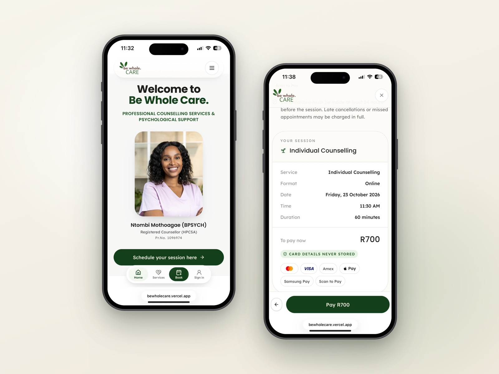
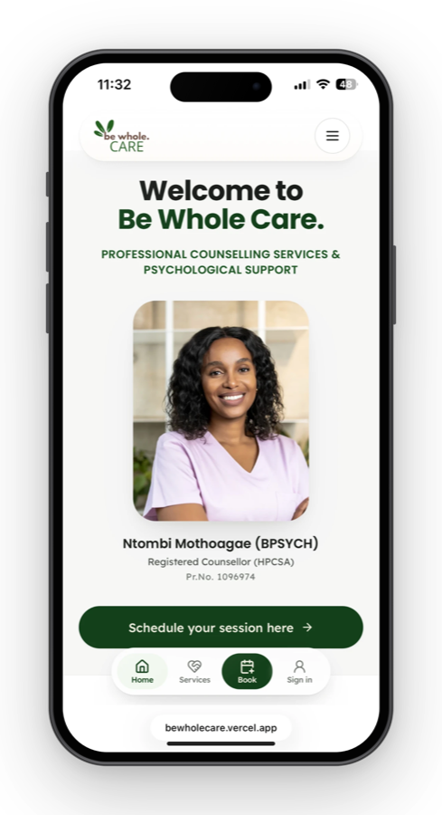
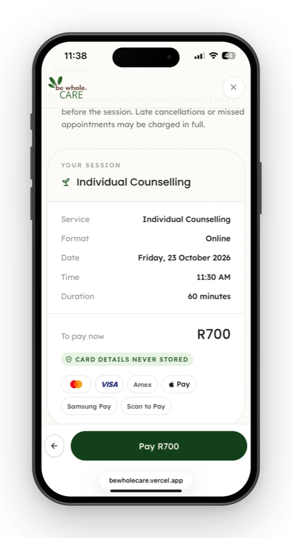

# Be Whole Care — booking & practice platform

> A renewed mind, a prospering soul.

The website, online booking and practice console for **Be Whole Care**, the counselling practice of
Ntombi Mothoagae (BPSYCH), Registered Counsellor (HPCSA), with practices in Centurion and Tembisa
and online sessions.

**Live:** [bewholecare.vercel.app](https://bewholecare.vercel.app)



---

## What it does

### For clients

- **Book online in a few minutes**: choose a service, online or in person (Centurion or Tembisa),
  a date and an available time, enter their details, agree to the informed consent and pay (card
  or medical aid). Each step opens at the top of the page on a phone.
- **Couples, family and pre-marital sessions** take the details of everyone attending (2–6
  people), and each of them agrees to the informed consent.
- **Medical aid**: the booking is held as a *Provisional Confirmation* while the practice verifies
  cover; the client is emailed the outcome either way.
- **Emails in the practice's own words**: confirmation, medical aid outcome, the online session
  link or practice address, and a formal reminder the morning before and the morning of the
  session. See [docs/EMAILS.md](docs/EMAILS.md).
- **Client portal**: upcoming sessions, rescheduling and cancelling, payments and receipts.

### For the practice (the console at `/admin`)


- **Dashboard**: today's sessions, payments awaiting, follow-ups due and 30-day revenue.
- **Appointments**: accept or decline medical aid, add the online session link, mark complete or
  missed, record a payment, print the client's consent form, cancel.
- **Calendar**: the week at a glance; block out leave and public holidays.
- **Clients**: each client's history, notes, consents (printable) and messages.
- **Follow-ups**: schedule a follow-up session and, if needed, request payment for it.
- **Payments**: every amount owed to or received by the practice in one place, including medical
  aid claims, which are ticked off with the amount the scheme actually paid.
- **Settings**: the administrator's console password, including a "forgot password" that emails
  a one-time code to the administrator's own address.

How to use each of these day to day: [docs/PRACTICE-GUIDE.md](docs/PRACTICE-GUIDE.md).

| | |
|---|---|
|  |  |

---

## Documentation

| Document | What's in it |
|---|---|
| [docs/PRACTICE-GUIDE.md](docs/PRACTICE-GUIDE.md) | Using the console: medical aid, payments, consent forms, blocking time, passwords |
| [docs/EMAILS.md](docs/EMAILS.md) | Every email the system sends, when, and to whom |
| [docs/CHANGELOG.md](docs/CHANGELOG.md) | What changed, release by release |
| [DEPLOY.md](DEPLOY.md) | Setting up Vercel, Supabase, email, calendar and payments |
| [PAYMENTS.md](PAYMENTS.md) | How payments are taken, verified and recorded |
| [SECURITY.md](SECURITY.md) | How the platform protects client data, and the rules for keeping it that way |

---

## Running it locally

```bash
npm install
npm run dev          # http://localhost:5600
```

It runs with **no environment variables at all**. Without `DATABASE_URL` the app uses a local JSON
file store (`.data/db.json`, git-ignored) seeded with clearly-marked demo clients and appointments,
and payments, calendar and email fall back to mock providers that log instead of sending — so the
whole booking journey works end to end on a laptop.

The local demo accounts (an administrator, a staff member and demo clients) are defined in
[`lib/db/seed.ts`](lib/db/seed.ts). **They exist only in the local JSON store** — the production
seed creates no demo users.

```bash
npm run typecheck    # tsc --noEmit
npm run build        # production build (runs the Postgres seed first; needs DATABASE_URL)
npx next build       # production build without the seed, for checking locally
npm run reseed       # clear the local datastore; it reseeds on the next request
```

> Don't run a build while `npm run dev` is running — they share `.next/`.

### Environment variables

Every variable is listed, with no values, in [`.env.example`](.env.example). Real values live only
in Vercel's environment settings and your own git-ignored `.env.local` — never in the repository.
The essentials in production are `DATABASE_URL`, `SESSION_SECRET`, `NEXT_PUBLIC_APP_URL`,
`CRON_SECRET` and `RESEND_API_KEY`; see [DEPLOY.md](DEPLOY.md) for the rest.

---

## How it's built

**Next.js 14** (App Router, server actions) on **Vercel**, **PostgreSQL** on **Supabase**, email
through **Resend**, optional **Google Calendar** sync, and card payments through a pluggable
gateway (Peach Payments, Payfast or Yoco).

```
app/
  (marketing)/        public site — home, services, about, contact, consent, legal
  (auth)/             sign-in, register, forgot-password
  book/               booking wizard and confirmation page
  portal/             client portal (signed-in clients)
  admin/              practice console (staff only; Settings is administrator only)
  print/consent/      printable consent record for a booking (staff only)
  api/                availability, payment webhook, reminders cron, assistant, health
  actions/            server actions — the only write paths in the app
components/           UI and feature components
services/             booking, availability, payments, calendar, notifications, events
lib/db/               data layer: pg-repo.ts (Postgres) and json-repo.ts (local), one interface
lib/                  auth, validation, rate limiting, dates, money
config/business.ts    the practice's facts: services, rates, locations, hours, consent wording
db/schema.sql         the production schema
scripts/              deploy seed and admin helper scripts
```

**The rule that shapes everything:** pages never talk to a provider or a table directly. They call
a service; the service calls the data layer (`lib/db`) or a provider interface. The Postgres and
JSON implementations are type-checked against each other, so they cannot drift.

### Things worth knowing

- **No double booking.** The slot is re-checked when the booking is saved, and Postgres has an
  exclusion constraint on overlapping appointments, so two people grabbing the same time at the
  same moment end with exactly one booking.
- **Invoice numbers.** Every booking's reference is a gapless running number — `BWC0001`,
  `BWC0002`, … — taken in the same database transaction that saves the booking, so the practice
  can use it as the invoice number.
- **Payment status never comes from the browser.** A card payment is confirmed only by a
  server-to-server check with the gateway; everything else (medical aid, Yoco links, EFT) is ticked
  off by the practice on the Payments page. See [PAYMENTS.md](PAYMENTS.md).
- **Slow work happens after the response.** Calendar sync and emails run in the background
  (`waitUntil`), so buttons in the console answer immediately.
- **The deploy seeds the database.** `npm run build` runs [`scripts/seed-postgres.mjs`](scripts/seed-postgres.mjs)
  first: it keeps the catalogue, locations, bookable hours (the published `BUSINESS_HOURS`) and
  settings in step with the code
  and applies small, idempotent schema additions. It never creates demo data.
- **Reminders** go out at 06:00 (South African time) the day before and the morning of a confirmed
  session. Vercel's Hobby plan runs the reminder job once a day (05:00 UTC); see [DEPLOY.md](DEPLOY.md).

### Known limitations

- **"Forgot your password?"** on the sign-in page resets the **console administrator's** password
  with an emailed code. For client accounts it still asks the practice to verify the person and
  send a link.
- Calendar apps refresh a subscribed calendar on their own schedule (Apple: minutes; Outlook and
  Google: hours), so a new booking can take a while to appear there. The console calendar is
  always current.
- Same-day reminders depend on how often the reminder job runs (see above).

---

## Security & privacy (POPIA)

The short version — full detail in [SECURITY.md](SECURITY.md):

- Identity is resolved on the server from a signed, http-only session cookie; roles
  (`CLIENT · STAFF · ADMIN · SUPER_ADMIN`) are checked on the server for every action.
- Passwords are hashed with scrypt; changing one signs out every other device.
- Every write is validated with zod on the server; login, registration, booking, contact and
  password resets are rate-limited.
- Card details never reach this application. Secrets are server-only and never committed.
- The browser never talks to the database; every table has row-level security with no permissive
  policies.
- An append-only audit log records administrative actions on client records, including viewing a
  consent record.

The app is not an emergency service. Crisis lines (112, SADAG 0800 456 789) are shown on the
contact page, in the assistant, on resource pages and on the offline screen.
