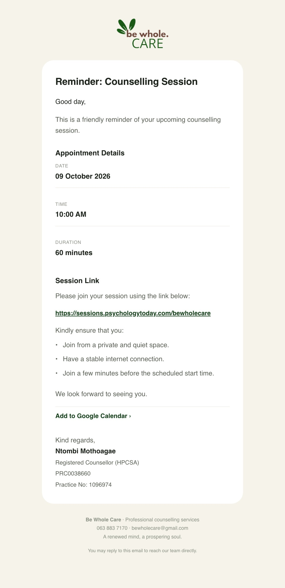

# Emails

Every email the platform sends, when it is sent and who receives it. Client emails use the
practice's own wording (supplied by Ntombi Mothoagae) and are signed with her name, Registered
Counsellor (HPCSA), PRC0038660 and Practice No: 1096974.

All emails are sent through Resend with the Be Whole Care logo embedded, in a light design that
stays light on phones set to dark mode, and sized to read without zooming on a phone. Sending is
code in [`services/events.ts`](../services/events.ts) (what and when) and
[`services/notifications/index.ts`](../services/notifications/index.ts) (how it looks and is
delivered).

## To the client

| Email | Sent when | What it contains |
|---|---|---|
| **Booking received — medical aid verification in progress** | A booking is made with medical aid | The booking details. No session link or address yet. |
| **Payment required to confirm your appointment** | A card booking is waiting for payment | The amount and a payment button. |
| **Appointment confirmation — {date}** | Payment clears, the practice marks a payment received, or a no-charge booking is made | Ntombi's confirmation: date, time and duration; **online** — the session link and the "Kindly ensure that you…" checklist; **in person** — the practice address. |
| **Medical aid verified — appointment confirmed for {date}** | The practice accepts the medical aid | Ntombi's verified template: date, time, and the address or session link. |
| **Update regarding your medical aid** | The practice declines the medical aid | Ntombi's wording: the session will be on a cash basis, with a **Make payment** button (the practice's Yoco payment link). Includes the practice's note if one was typed. |
| **Your online session link — {date}** | The practice adds or changes an online session's link | The link and the checklist. |
| **Reminder: Counselling Session** | **06:00 the day before** and **06:00 on the morning of** every confirmed session | "Good day," · "This is a friendly reminder of your upcoming counselling session." · date, time, duration · session link (online) or address (in person) · "We look forward to seeing you." · "Kind regards," |
| **Appointment rescheduled — {date}** | The session is moved | The new date and time. |
| **Appointment cancelled — {date}** | The session is cancelled by the client or the practice | Confirmation of the cancellation. |
| **Your payment was unsuccessful** | A card payment fails | How to try again. |
| **Follow-up session emails** | The practice creates a follow-up | A reminder, a payment request if one is needed, and a confirmation once paid. |
| **Thank you for contacting Be Whole Care** | The contact form is sent | An acknowledgement and the practice's hours. |
| **Your password request** | Someone uses "Forgot your password?" on the sign-in page | Tells them the practice will verify them and send a link. |

**Never sent:** anything after a session. The "thank you for your session" and next-day check-in
emails were removed at the practice's request.

The session link and practice address are only ever sent once a booking is **confirmed** — after
payment or after the medical aid is accepted — never while it is still pending.

Reminders are prepared when the session is confirmed and sent by the reminder job (see
[DEPLOY.md](../DEPLOY.md)). Rescheduling or cancelling replaces or withdraws them, and turning a
reminder off is no longer available in Settings — both reminders always go out.

## To the practice (bewholecare@gmail.com)

| Email | Sent when |
|---|---|
| **Medical aid to verify — {client}, {date}** | A client books with medical aid. Includes the scheme, member number and main member. |
| **New booking — {client}, {date}** | A booking is confirmed. |
| **Rescheduled — {client}, now {date}** | A session is moved. |
| **Cancelled — {client}, {date}** | A session is cancelled. |
| **Website enquiry** | The contact form is sent. |

Booking emails to the practice list the client's name, email and phone, the service, date, time,
place and reference, and — for couples, family and pre-marital sessions — **everyone else
attending**, with their contact details.

## Security emails

| Email | Sent when |
|---|---|
| **Your Be Whole Care verification code** | The administrator uses "Forgot your current password?" in console Settings. |
| **Your console password was changed** | The console password is changed, either way. |

The content of these two is **never stored**: the email log records only that they were sent.

## Changing the wording

Client email wording lives in [`services/events.ts`](../services/events.ts); the session link,
practice addresses, Yoco link and practitioner details used in emails are in `CLIENT_EMAIL` in
[`config/business.ts`](../config/business.ts). Change them there and redeploy.
