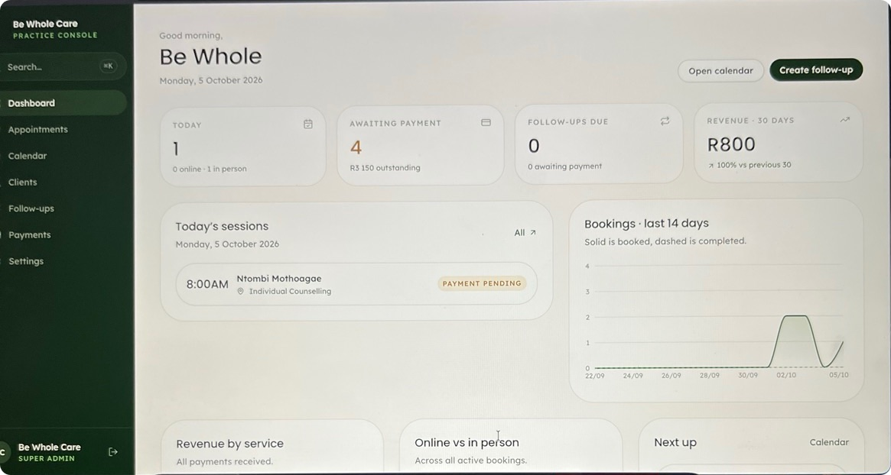

# Practice guide — using the console

A plain-English guide for the practice. Sign in at **bewholecare.vercel.app/sign-in**; the console
opens at **/admin**.

The menu: **Dashboard · Appointments · Calendar · Clients · Follow-ups · Payments · Settings**.

---

## Booking references are invoice numbers

Every booking gets a running number — **BWC0001, BWC0002, BWC0003…** — with no gaps. It appears in
every email and in the console, so you can use it as the invoice number.

## Medical aid bookings

When a client books with medical aid, their time is held and they see **Provisional
Confirmation**. You get a "Medical aid to verify" email with their scheme, member number and main
member.

1. Go to **Appointments** and pick the **Medical aid to verify** filter.
2. On the booking, click **Accept aid** or **Decline**:
   - **Accept & confirm** — the session is confirmed, added to the calendar, and the client gets
     the "Medical aid verified" email (with the session link or address). A **claim line** appears
     on **Payments**, awaiting the scheme's payment.
   - **Decline & request payment** — the session stays booked at the private fee, and the client
     gets the "Update regarding your medical aid" email with a **Make payment** button (Yoco).
     You can add a note for the client; it is included word for word. A line appears on
     **Payments**, awaiting the client's payment.

## Payments — ticking money off

**Payments** lists every amount owed to or received by the practice. The four boxes at the top
show what came in over the last 30 days (medical aid included), medical aid claims still awaiting
the scheme, client payments still outstanding, and anything marked as not paid.

| When… | Do this |
|---|---|
| The **medical aid scheme pays** a claim | On the claim's line, **Mark received** → enter the amount the scheme actually paid (often less than the fee) and the day it arrived. |
| The **scheme refuses** the claim | **Not paid** → add a note such as "Benefits exhausted". |
| A client **pays through the Yoco link** after a declined medical aid | On their line, **Mark received**. Their session is confirmed and they automatically get their confirmation email with the link or address. |
| You ticked something **by mistake** | **Undo** — the line goes back to awaiting, at the original amount. |
| A client paid **by card online** | Nothing — it is confirmed automatically by the payment provider. |
| You took money **directly** (EFT, cash, a quoted fee such as a psychometric assessment) | **Appointments** → **…** on the booking → **Record a payment** → amount, date and who paid (the client or their medical aid). |

Clients see medical aid claims in their portal as "Claimed from your scheme" or "Paid by your
scheme" — never as money they owe.

## Online sessions

Clients receive the practice's session link (sessions.psychologytoday.com/bewholecare) once their
booking is confirmed, and again in each reminder. To use a different link for one session:
**Appointments** → **…** → **Add session link** — the client is emailed the new link.

## Couples, family and pre-marital sessions

These are for 2 to 6 people. The person booking adds everyone else attending, and **each person
agrees to the informed consent** on the booking form. You'll see the others under the client's
name in **Appointments** ("With …"), in your booking emails and on the consent form.

## Consent forms

- **For a booking:** **Appointments** → **…** → **Consent form**, or **Clients** → the client →
  **Consent & comms** → **Print** next to "Informed Consent". It opens a ready-to-print A4 form
  showing every point agreed, the exact date and time it was agreed online, everyone else attending
  and lines for your signature. Click **Print or save as PDF**.
- **Blank form** for in-person clients: open **bewholecare.vercel.app/consent** and print it.
- If a booking was made without online consent (for example, one you made yourself), the form says
  so — take consent in person and sign it.

## Days off and holidays

**Calendar** → **Block time** → choose the date, the whole day or part of it, and a reason →
**Block it**. Clients can no longer book that time; existing bookings are not affected. Remove a
block from the same window.

## Other things you can do with a booking

From **Appointments** → **…**: **Open client**, **Mark complete**, **Mark as missed**, **Resend
confirmation**, **Retry calendar sync** (if Google Calendar was unavailable) and **Cancel
appointment** (the client is emailed). Marking a session complete sends **no** email to the client.

## Follow-ups

**Follow-ups** → **Create follow-up**: choose the client, service, date and whether payment is
needed. The client is reminded on the date you choose and, if payment is needed, sent a payment
request; the session is confirmed once they pay.

## Your console password

**Settings** (administrator only):

- **Change password** — enter your current password and a new one (at least 10 characters, with
  upper and lower case and a number). Other devices are signed out and you get an email notice.
- **Forgot your current password?** — **Email me a code** sends a 6-digit code to the console's
  email address. Enter it with your new password and click **Set new password**. The code works
  once and expires after 10 minutes.

If you are signed out and have forgotten your password, contact your website developer.

## What clients see

1. Choose a service, online or in person (Centurion or Tembisa), a date and a time.
2. Enter their details — name, email, mobile, address and an emergency contact (all required) —
   and, for couples/family/pre-marital sessions, everyone else attending.
3. Agree to the informed consent (each person, for group sessions).
4. Pay by card, or choose medical aid (scheme, membership number, date of birth, main member and
   their ID number — all required).
5. See **Provisional Confirmation** — "Please note that our Counsellor will get in touch with you
   shortly, to confirm the details of your booking." (Medical aid bookings see the practice's
   medical aid wording.)

Every email they receive is described in [EMAILS.md](EMAILS.md).
